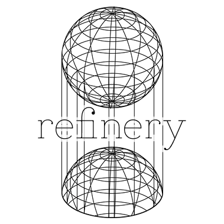

# REFINERY: Python/C++ library to use Nearest Refiner Algorithm

  

---

The Nearest Refiner (NR) algorithm is a lightweight refinement strategy that enhances an existing solution estimate using local optimization principles. It operates by taking an initial datapoint—usually obtained from a prior search or approximate model—and iteratively adjusting it to minimize a defined loss function such as MSE, MAE, or cosine error. Unlike global optimizers, NR focuses only on fine-tuning near the initial region, making it computationally efficient for high-dimensional problems. It estimates gradients numerically through small perturbations and updates the solution based on the chosen optimizer, typically Gradient Descent or its variants. This localized correction process enables NR to achieve rapid convergence and improved precision, particularly in scenarios like inverse kinematics, parameter estimation, and neural refinement, where small but critical improvements in accuracy are required.

---

## Under Development (Pre-Alpha)
The Refinery library is currently in its pre-alpha development stage, representing an early experimental phase of its evolution. At this stage, the framework is functional but highly fluid—core systems such as optimization pipelines, loss computation, and refinement logic are still being actively designed, tested, and restructured. The focus of the pre-alpha phase is on prototyping algorithms, verifying mathematical correctness, and establishing a modular architecture that can later support additional optimizers, loss functions, and data interfaces. As such, the current build is intended primarily for research and internal testing, not for production use. Frequent API changes, incomplete documentation, and unoptimized performance are expected until the project stabilizes in the upcoming alpha release.